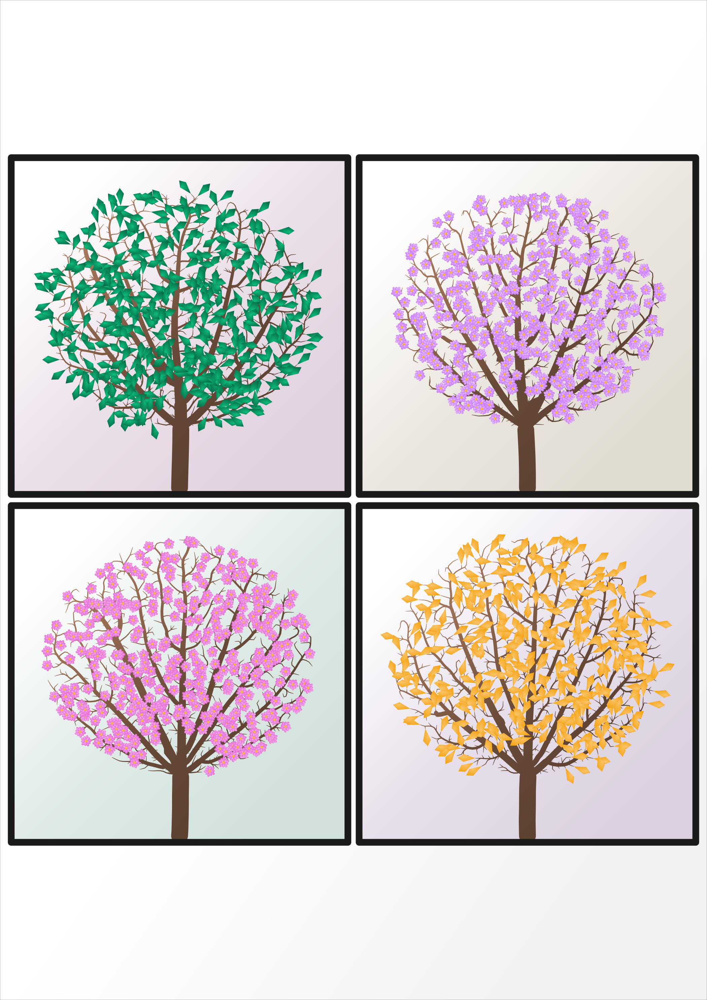

# BP Designs - Algorithmic Pattern Generation



Generative system for creating natural, algorithmic patterns for physical fabrication.

**Core Philosophy:** Deterministic algorithms → organic emergence → physical craft

---

## Supported Algorithms

- **Branching (Space Colonization):** Organic, tree-like growth patterns with custom growth strategies and organic rendering.
- **Cellular (Voronoi):** Natural tiling and cellular structures (Phase 2: refinement in progress).
- **Organs (Procedural Blossoms):** Multi-ring, organic petal shapes for decorative elements.
- **Primitives:** 2D shapes (Ovals, Regular Polygons) as building blocks.

---

## Quick Start

### Prerequisites
- Python 3.12
- [Poetry](https://python-poetry.org/docs/#installation)

### Setup
```bash
# Clone and install
poetry install

# Run tests
poetry run pytest

# Format and lint
poetry run ruff format
poetry run ruff check
```

---

## Experiment Workflow

### 1. Run an Experiment
```bash
# Generate parameter variations
poetry run python src/experiments/regular_polygon_basic.py

# Output: output/experiments/[experiment_name]/
```

### 2. View Results
```bash
# Option A: Direct (if browser allows file:// access)
open gallery/index.html

# Option B: HTTP server
python -m http.server 8000
# Then: http://localhost:8000/gallery/
```

### 3. Iterate
- Select experiment from dropdown
- Compare parameter effects visually
- Document findings in `docs/exploration/[date]_[topic].md`
- Update `docs/exploration/LEARNINGS.md` with insights

**See:** `docs/ARCHITECTURE_GALLERY.md` for technical details

---

## Design Goals

### Algorithmic, Not AI
- Deterministic, rule-based generation (L-systems, space colonization, reaction-diffusion)
- No machine learning, no diffusion models
- Reproducible: same seed → same output

### Composability
Patterns are building blocks:
- Layerable
- Combinable
- Transformable
- Maskable

### Craft-Aware
Physical manufacturing constraints:
- Minimum line thickness
- Minimum spacing
- Adequate negative space
- Embossable depth and detail

**See:** `docs/design_goals.md` for full philosophy

---

## Testing

```bash
# Run tests
poetry run pytest

# With coverage
poetry run pytest --cov=src --cov-report=term-missing

# Run specific test
poetry run pytest tests/test_space_colonization.py
```

---
