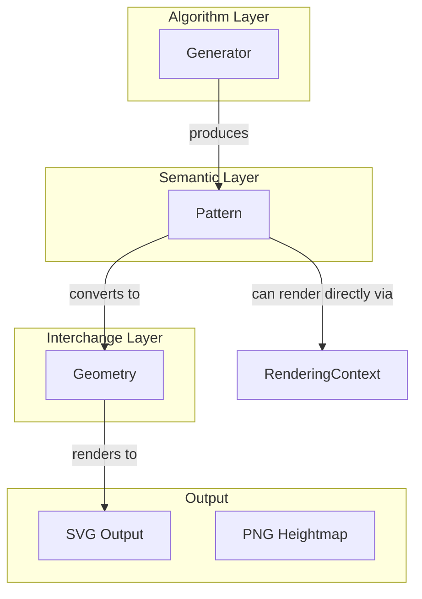
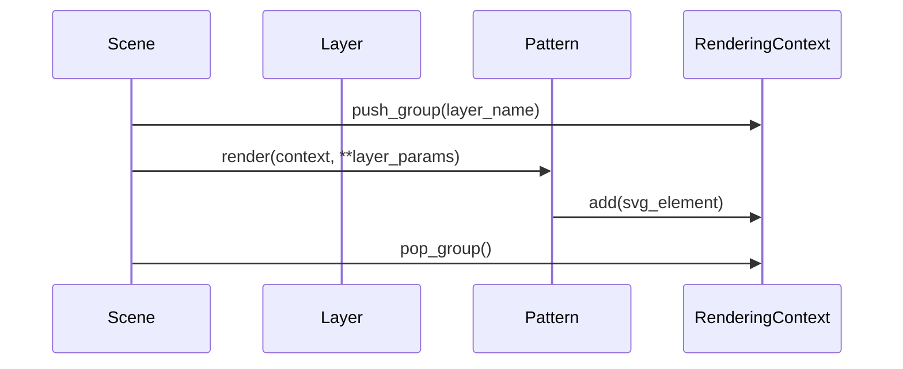

# Current Architecture - BP Designs

This document describes the current architecture of the `bp-designs` project as of February 2026. It assesses the alignment of the implementation with the objectives defined in [`docs/design_goals.md`](docs/design_goals.md).

## 1. Core Architecture: The Three-Layer System

The system is built on a three-layer abstraction that separates algorithms, semantic data, and geometric representation.

### 1.1 The Design Lifecycle
The overall flow from experiment definition to visual discovery in the gallery follows a systematic pipeline:

### 1.2 Layered Abstraction

### 1.1 Generator (Algorithm Layer)
- **Location:** [`src/bp_designs/core/generator.py`](src/bp_designs/core/generator.py)
- **Role:** Encapsulates deterministic algorithms.
- **Implementation:** Abstract base class `Generator` with a `generate_pattern()` method.
- **Key Examples:** `SpaceColonization`, `VoronoiGenerator`.

### 1.2 Pattern (Semantic Layer)
- **Location:** [`src/bp_designs/core/pattern.py`](src/bp_designs/core/pattern.py)
- **Role:** Represents the *meaning* of the generated data (e.g., a branching hierarchy, a cellular tessellation).
- **Implementation:** Abstract base class `Pattern`. It holds `render_params` and a reference to a `Canvas`.
- **Key Examples:** `BranchNetwork`, `OrganPattern`, `Scene`.
- **Alignment:** High. By preserving semantics (like parent-child relationships in trees), the system allows for sophisticated post-processing (like tapering based on descendant count) that would be impossible with raw geometry.

### 1.3 Geometry (Interchange Layer)
- **Location:** [`src/bp_designs/core/geometry.py`](src/bp_designs/core/geometry.py)
- **Role:** Data containers for geometric primitives, acting as a bridge to external libraries (Shapely, numpy).
- **Implementation:** Classes like `Point`, `PointSet`, `Polygon`, `Polyline`.
- **Design Rule:** Geometry classes store data but do not implement complex algorithms (which are delegated to specialized libraries).

---

## 2. Composability

Composability is a core design goal ([`docs/design_goals.md`](docs/design_goals.md)). It is achieved through three primary mechanisms:

### 2.1 Pattern-as-Input (Functional Composition)
Generators are designed to accept `Pattern` objects as parameters. This creates a feedback loop where the output of one algorithm defines the constraints or guidance for the next.

**Example ([`src/experiments/grid.py`](src/experiments/grid.py)):**
1. An `Oval` primitive generates a `Pattern`.
2. This pattern is passed to `SpaceColonization` as the `initial_boundary`.
3. The tree grows strictly within the bounds defined by the oval.

### 2.2 Layering and Scenes
- **Location:** [`src/bp_designs/core/scene.py`](src/bp_designs/core/scene.py)
- **Mechanism:** The `Scene` class is itself a `Pattern` that contains multiple `Layer` objects. Each layer holds a `Pattern` and its own `render_params`.
- **Data Flow:**

### 2.2 Pattern Combinators
- **Location:** [`src/bp_designs/core/combinator.py`](src/bp_designs/core/combinator.py)
- **Status:** Partially implemented/Conceptual.
- **Operations:**
    - `guide()`: Uses one pattern's field to influence another's growth.
    - `texture()`: Fills a skeleton with a texture pattern.
    - `nest()`: Generates patterns within regions defined by another pattern.
    - `blend()`: Arithmetic blending of fields.

---

## 3. Craft-Awareness and Manufacturing

The system is designed for physical fabrication (embossing, 3D printing).

### 3.1 SVG Output
- **Primary Format:** SVG is the first-class citizen, preferred for CNC and laser tools.
- **Implementation:** `Pattern.to_svg()` provides a consistent entry point, using `Scene` and `RenderingContext` to produce structured, layered SVGs.

### 3.2 Physical Constraints
- **Line Thickness:** Managed via `BranchThicknessStrategy` ([`src/bp_designs/patterns/network/thickness.py`](src/bp_designs/patterns/network/thickness.py)). Supports tapering based on hierarchy.
- **Detail Control:** `NetworkRefinementStrategy` ([`src/bp_designs/patterns/network/refinement.py`](src/bp_designs/patterns/network/refinement.py)) provides `decimate`, `relocate`, and `subdivide` to manage segment density and smoothness.
- **Skinning:** `NetworkRenderer.to_polygon()` uses Shapely to create unioned "skins" around networks, ensuring manufacturable outlines rather than just overlapping strokes.

---

## 4. Experimentation and Gallery

A systematic approach to exploration.

### 4.1 Experiment Runner
- **Location:** [`src/bp_designs/experiment/runner.py`](src/bp_designs/experiment/runner.py)
- **Role:** Executes parameter sweeps in parallel.
- **Output:** Generates a directory per experiment containing SVGs, metadata (JSON), and an updated `index.json` for the gallery.

### 4.2 Parameter Space
- **Location:** [`src/bp_designs/experiment/params.py`](src/bp_designs/experiment/params.py)
- **Role:** Defines grids of parameters, including "derived" parameters (e.g., background color coupled to pattern color).

---

## 5. Key Architectural Decisions (ADRs)

| Decision | Source | Rationale |
|----------|--------|-----------|
| **Semantic Preservation** | `docs/api.md` | Keep hierarchy/topology data as long as possible to enable smart rendering. |
| **Geometry as Interchange** | `docs/api.md` | Avoid re-implementing geometric algorithms; use Shapely/numpy but wrap them to stay library-agnostic. |
| **Canvas-Relative Coordinates** | `src/bp_designs/core/pattern.py` | Patterns are defined in their own space and resolved to a `Canvas` only at render/export time. |
| **Strategy Pattern for Growth** | `src/bp_designs/generators/branching/space_colonization.py` | Decouple topology, attraction, and growth logic to allow "Wild" variants. |
| **Pydantic for Render Styles** | `src/bp_designs/core/renderer.py` | Use structured, validated models for complex rendering parameters. |

## 6. Alignment Assessment

| Goal | Status | Notes |
|------|--------|-------|
| **Algorithmic, not AI** | ✅ Full | All generators are rule-based and deterministic. |
| **Natural but not figurative** | ✅ Full | Focus on branching and cellular growth behaviors. |
| **Composability** | 🟡 Partial | Layering is solid; Field-based combinators are defined but less mature. |
| **Craft-aware** | ✅ Full | Strong focus on thickness, refinement, and SVG structure. |
| **Deterministic** | ✅ Full | Seed-based RNG used throughout. |
