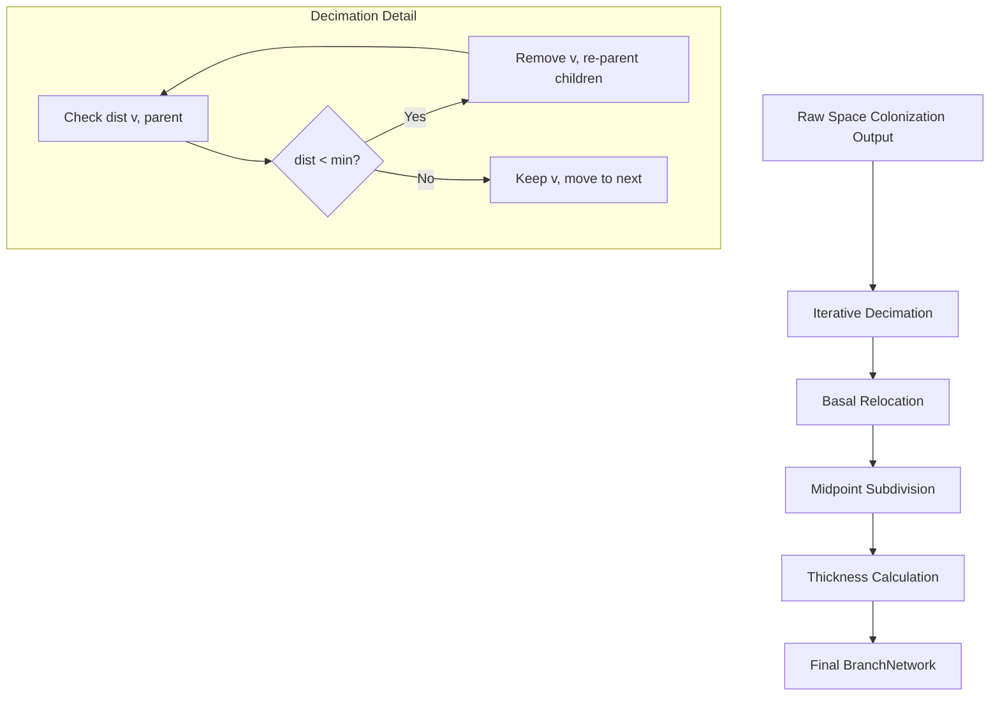

# Refinement Improvement Plan

Based on the original Runions et al. (2007) paper and our current implementation analysis, we need to align our refinement strategy with the paper's "Decimate -> Relocate -> Subdivide" workflow and improve the individual algorithms.

## 1. Iterative Decimation
Our current decimation is a single-pass distance check. Because growth uses a fixed `segment_length`, this is "all or nothing."

**Proposed Change:**
Implement an iterative decimation in `BranchNetwork.decimate` using a topological pass (root-to-leaf).
- Process nodes in order of increasing depth (topological sort).
- For each node, check distance to its *current* parent.
- If `dist < min_distance`, remove the node and re-parent its children to its parent.
- This is $O(N)$ and avoids the "all or nothing" issue by allowing segments to accumulate length.
- Optimization: Use NumPy for the distance checks and parent updates where possible, but the topological pass requires a loop.

## 2. Basal Relocation (Angle Reduction)
The paper describes a specific relocation step: "Moving each remaining node in parallel half way toward its more basal neighbor reduces the branching angles."

**Proposed Change:**
Update `BranchNetwork.relocate` to support a `basal` mode.
- **Basal Mode:** For each node $v$, move it towards its parent $p$: $v' = (1-\alpha)v + \alpha p$.
- **Laplacian Mode:** (Existing) Move toward average of parent and children.
- Basal relocation specifically "pulls" the branches tighter, reducing the angle at branching points as described in the paper.

## 3. Refinement Reordering
Our current `NetworkRefinementStrategy` applies steps in the order: `Decimate -> Subdivide -> Relocate`.

**Proposed Change:**
Update `NetworkRefinementStrategy.apply` to follow the paper's order:
1. **Decimate** (Iterative)
2. **Relocate** (Basal/Laplacian)
3. **Subdivide** (Midpoint)

## 4. Thickness Preservation
Ensure that all refinement steps preserve the semantic information required for `DescendantThickness`.
- `parents` must be correctly updated during decimation and subdivision.
- `timestamps` should be interpolated during subdivision.
- `node_ids` must remain unique.

## Mermaid Diagram: Refinement Workflow

## Action Items
- [ ] Modify `BranchNetwork.decimate` in `src/bp_designs/patterns/network/base.py` to be iterative.
- [ ] Add `relocate_basal` to `BranchNetwork` or add a `mode` to `relocate`.
- [ ] Update `NetworkRefinementStrategy.apply` in `src/bp_designs/patterns/network/refinement.py` to reorder steps.
- [ ] Add tests in `tests/test_refinement.py` to verify the new logic.
